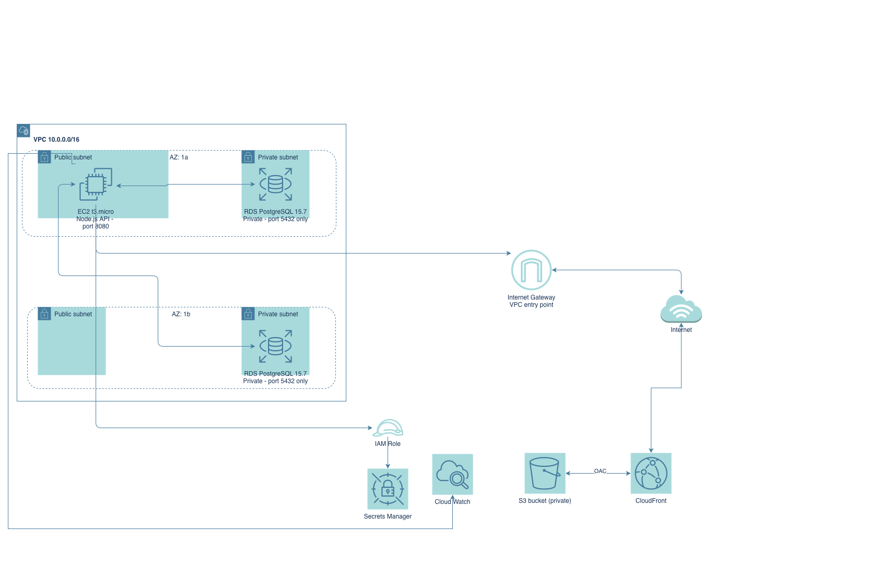

```markdown
# Three-Tier AWS Web Application

A fully functional three-tier web application deployed on AWS using Terraform. Built as a cloud engineering portfolio project demonstrating infrastructure as code, network design, security best practices, and AWS service integration.

---

## Architecture

```
Internet
    ↓
CloudFront (HTTPS) → S3 (private) — Frontend
    ↓
EC2 t3.micro (public subnet) — Backend API
    ↓
RDS PostgreSQL 15.7 (private subnet) — Database
```

---

## Tech Stack

| Layer | Service |
|---|---|
| Frontend | S3 + CloudFront |
| Backend | EC2 (Amazon Linux 2023, Node.js) |
| Database | RDS PostgreSQL 15.7 |
| Networking | VPC, Subnets, Security Groups |
| IaC | Terraform |
| Secrets | AWS Secrets Manager |
| Monitoring | CloudWatch |
| Version Control | Git + GitHub |

---

## What It Does

- Frontend static site served via CloudFront over HTTPS from a private S3 bucket
- Backend Node.js REST API running on EC2 in a public subnet
- PostgreSQL database running in a private subnet with no public internet access
- Database credentials stored encrypted in AWS Secrets Manager — nothing hardcoded
- EC2 retrieves credentials via IAM role at runtime — no hardcoded AWS credentials
- CloudWatch alarm fires if EC2 CPU exceeds 80% for two consecutive periods

---

## Security Design

- RDS placed in private subnets — unreachable from the public internet
- RDS security group only allows port 5432 traffic from the backend security group specifically
- S3 bucket is fully private — accessible only via CloudFront using Origin Access Control
- IAM role attached to EC2 with least privilege — only permission is reading the DB secret
- Secrets Manager stores credentials encrypted — no passwords in code or config files

---

## How to Deploy

### Prerequisites
- AWS CLI configured with valid credentials
- Terraform installed
- Git installed

### Steps

```bash
git clone https://github.com/cristianxcueva/Three-Tier-App-AWS.git
cd Three-Tier-App-AWS/terraform
terraform init
terraform apply
```

Terraform will output the CloudFront URL, EC2 public IP, and RDS endpoint after apply completes.

---

## Known Limitations

- The frontend button fails when loaded via the CloudFront URL due to browser mixed content blocking. The frontend is served over HTTPS via CloudFront but the backend API runs on plain HTTP. The production fix is an Application Load Balancer with an SSL certificate from AWS Certificate Manager in front of EC2, or routing API traffic through CloudFront as a second origin.

---

## What I Learned

- Designing multi-tier AWS architecture with proper network isolation
- Writing Terraform HCL to provision and manage AWS infrastructure as code
- Implementing least privilege security with IAM roles and security groups
- Storing and retrieving secrets securely with AWS Secrets Manager
- Deploying a CDN with CloudFront and locking down S3 with Origin Access Control
- Debugging real AWS errors including engine version conflicts, Secrets Manager recovery windows, and mixed content blocking

---

## Author

Cristian — IT Support Analyst transitioning into Cloud Engineering
[GitHub](https://github.com/cristianxcueva)
```